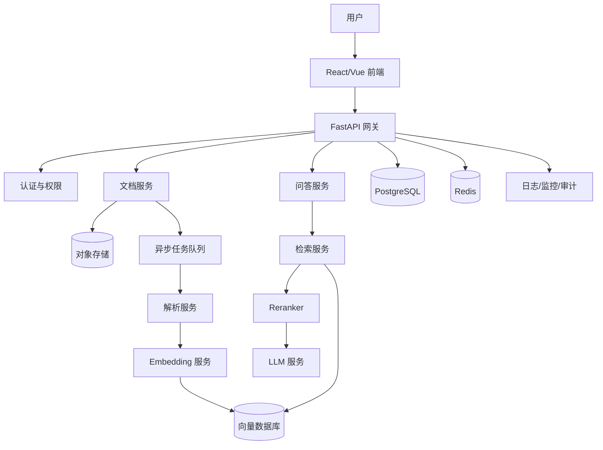

# firstRAG 代码学习与生产复用指南

> 适用读者：有 Python 基础、能看懂函数和类，但缺少完整项目经验的开发人员。  
> 目标：结合本项目代码，理解一个 RAG 系统是如何分层、如何调用、如何保存数据、如何处理异常，并为后续复用到生产项目做好准备。

---

# 1. 阅读这份文档前需要具备什么

不要求你已经熟悉大模型或向量数据库，但建议具备以下基础：

- 能看懂 Python 函数、类、模块；
- 知道 `try/except/finally`；
- 知道列表、字典、集合；
- 知道文件读写；
- 知道 HTTP API 的基本概念；
- 会使用 Git；
- 会创建 Conda 环境；
- 能运行 Pytest；
- 能看懂日志和 Traceback。

暂时不要求：

- 不要求会训练模型；
- 不要求会 PyTorch；
- 不要求会深度学习数学；
- 不要求会前端框架；
- 不要求会大型分布式系统。

---

# 2. 学习这个项目时，先建立一个总体认识

这个项目不是一个“大模型项目”，而是一个“业务系统 + 外部模型服务”的组合。

它主要由 5 部分构成：

```text
文档处理
向量生成
向量检索
大模型回答
网页交互
```

对应流程：

```text
上传文档
→ 解析
→ 分块
→ Embedding
→ FAISS
→ 用户提问
→ 检索相关块
→ MiniMax 回答
→ 展示引用
```

可以把系统理解为：

```text
文档解析器：把文件变成文本
文本分块器：把长文本切成小块
Embedding：把文本变成向量
FAISS：根据语义找相似文本
MiniMax：根据检索结果组织答案
Streamlit：给用户提供操作界面
```

---

# 3. 建议的代码阅读顺序

不要一开始就看 `app.py`。

页面代码会同时涉及：

- UI；
- session_state；
- 服务调用；
- Streamlit rerun；
- 异常处理；
- 流式输出。

对经验不足的开发者来说，直接看页面很容易混乱。

建议严格按照下面顺序阅读。

---

## 第 1 步：先看数据模型

文件：

```text
rag/models.py
```

重点关注：

- `DocumentInfo`
- `DocumentChunk`
- `RetrievedChunk`
- `ChatMessage`
- `ChatStreamEvent`

阅读目标：

1. 一个文档在系统中长什么样；
2. 一个 chunk 包含哪些字段；
3. 检索结果和普通 chunk 有什么区别；
4. 聊天消息保存哪些内容；
5. 流式事件如何表达。

建议边看边画：

```text
原始文件
→ DocumentInfo
→ DocumentChunk
→ RetrievedChunk
→ ChatMessage
```

生产项目中，数据模型是最重要的稳定边界。

---

## 第 2 步：看文档解析

文件：

```text
rag/parsers.py
```

重点理解：

```text
不同文件类型
→ 统一输出结构化文本单元
```

需要重点看：

- PDF 如何按页解析；
- DOCX 如何解析段落；
- DOCX 如何解析表格；
- TXT 如何处理编码；
- Markdown 如何处理标题；
- 如何保留页码、行号、表格编号；
- 空文档如何报错；
- 扫描型 PDF 如何识别。

阅读时重点思考：

```text
为什么解析器不能只返回一个大字符串？
```

答案是：

因为后面展示引用时，需要知道：

- 来自哪个文件；
- 第几页；
- 第几个表格；
- 哪几行；
- 哪个标题。

---

## 第 3 步：看文本分块

文件：

```text
rag/splitter.py
```

重点理解：

```text
长文档为什么不能整篇做 Embedding
```

主要原因：

- 文本太长；
- 检索粒度太粗；
- 命中后无法精确引用；
- 大模型上下文成本高；
- 文档中可能只有一小部分与问题相关。

重点关注：

```text
chunk_size
chunk_overlap
```

例如：

```text
chunk_size = 800
chunk_overlap = 120
```

含义：

- 每个 chunk 目标长度约 800 字符；
- 相邻 chunk 保留约 120 字符重叠；
- 防止句子或语义刚好被切断。

阅读代码时重点找：

- 短段落如何合并；
- 标题如何继承；
- chunk_id 如何生成；
- 元数据如何从解析结果传递到 chunk；
- 为什么要过滤纯空白、纯符号内容。

---

## 第 4 步：看 Embedding 抽象接口

文件：

```text
rag/embedding_provider.py
```

重点理解：

```text
为什么要先定义接口，再写具体实现
```

接口通常只描述：

```text
embed_documents(texts)
embed_query(text)
```

这样做的好处：

以后可以把：

```text
SiliconFlow
```

替换为：

```text
OpenAI
BGE
本地模型
其他云平台
```

而不需要修改 Retriever 或 KnowledgeBaseService。

这就是生产项目常见的：

```text
面向接口编程
```

---

## 第 5 步：看 SiliconFlow Embedding 实现

文件：

```text
rag/siliconflow_embeddings.py
```

重点关注：

- 请求参数；
- 模型名称；
- 批量处理；
- 返回顺序；
- 维度校验；
- `float32` 转换；
- L2 归一化；
- NaN 和 Inf 检查；
- 超时；
- 401、429、500 错误处理；
- 日志是否泄露 API Key。

要理解：

```text
Embedding 模型不是回答问题
```

它只负责：

```text
文本
→ 向量
```

例如：

```text
“周末几点开放”
→ [0.012, -0.035, 0.082, ...]
```

---

## 第 6 步：看 FAISS 向量库

文件：

```text
rag/vector_store.py
```

这是整个项目中比较重要、也比较值得仔细读的文件。

重点理解：

```text
FAISS 只存向量
chunks.jsonl 存文本
documents.jsonl 存文档信息
manifest.json 存配置
```

目录结构：

```text
storage/indexes/
├─ CURRENT
└─ snapshots/
   └─ snapshot_id/
      ├─ faiss.index
      ├─ chunks.jsonl
      ├─ documents.jsonl
      └─ manifest.json
```

需要重点看：

- 初始化空索引；
- 添加向量；
- 搜索；
- 删除文档；
- 清空；
- 保存快照；
- 加载快照；
- CURRENT 指针；
- manifest 校验；
- 向量与 chunk 的顺序对应；
- 写失败时如何避免破坏旧索引。

这部分最值得学习的是：

```text
先生成完整新快照
→ 校验
→ 再切换 CURRENT
```

它比直接覆盖原文件安全得多。

---

## 第 7 步：看 Retriever

文件：

```text
rag/retriever.py
```

Retriever 负责串联：

```text
用户问题
→ Embedding
→ FAISS 搜索
→ 返回 Top-K chunk
```

阅读时关注：

- 问题如何生成向量；
- 如何传给 FAISS；
- 返回几个结果；
- 如何生成 `S1`、`S2`；
- 相似度 score 如何保存；
- 空知识库如何处理；
- top_k 如何配置。

Retriever 不负责生成最终答案。

它的职责只有：

```text
找资料
```

---

## 第 8 步：看 PromptBuilder

文件：

```text
rag/prompt_builder.py
```

PromptBuilder 负责把：

```text
用户问题
+
检索结果
+
系统规则
```

组织成模型可以理解的输入。

重点关注：

- 来源如何格式化；
- `S1`、`S2` 如何放进 Prompt；
- 如何要求模型只依据资料回答；
- 如何要求无依据时拒答；
- 如何防止文档内容变成系统指令；
- 如何要求引用；
- 多轮问题改写 Prompt；
- 最终回答 Prompt。

生产项目中建议：

```text
Prompt 不要散落在多个业务文件中
```

最好集中管理、版本化、测试。

---

## 第 9 步：看 MiniMax 客户端

文件：

```text
rag/llm_client.py
```

重点关注：

- OpenAI 兼容接口；
- `complete()`；
- `stream()`；
- 消息格式；
- 超时；
- 异常映射；
- reasoning 过滤；
- `<think>` 过滤；
- `<analysis>` 过滤；
- 流式 token 拼接；
- API Key 脱敏。

特别注意：

```text
流式调用不是一次调用一个 token
```

而是：

```text
一次 HTTP 流式请求
→ 服务端连续返回多个 token
```

---

## 第 10 步：看知识库业务服务

文件：

```text
rag/knowledge_base_service.py
```

这是“文档入库”的总编排器。

建议画出调用链：

```text
ingest()
├─ 校验文件
├─ 计算 SHA256
├─ 检查重复
├─ 保存临时文件
├─ parse_document()
├─ split_document()
├─ embed_documents()
├─ vector_store.add_document()
└─ 保存原始文件
```

重点看：

- 哪一步失败会回滚；
- 临时文件何时删除；
- 是否会留下半完成数据；
- 重复文件如何处理；
- 删除文档如何调用 VectorStore；
- 清空知识库如何处理。

生产项目最值得学习的是：

```text
业务编排和底层实现分开
```

---

## 第 11 步：看聊天业务服务

文件：

```text
rag/chat_service.py
```

它负责完整问答流程：

```text
用户问题
→ 判断是否需要改写
→ 检索
→ 构造 Prompt
→ 调用 MiniMax
→ 过滤输出
→ 校验引用
→ 返回 ChatMessage
```

重点关注：

- 多轮历史如何传入；
- 当前问题是否重复进入 history；
- 什么时候触发问题改写；
- 检索结果如何传给 PromptBuilder；
- 无依据回答如何处理；
- 最终只保留哪些 citation；
- 流式事件如何发出；
- 异常如何转换成安全提示。

---

## 第 12 步：最后看 UI

文件：

```text
ui/state.py
ui/components.py
ui/service_factory.py
app.py
```

推荐顺序：

```text
ui/state.py
→ ui/components.py
→ ui/service_factory.py
→ app.py
```

重点理解：

- Streamlit 每次点击都会重新执行脚本；
- `st.session_state` 用于保存跨 rerun 状态；
- `st.cache_resource` 用于缓存服务对象；
- 为什么不能把 API Key 写进 session_state；
- 为什么不能在每个 token 中调用 `st.rerun()`；
- 为什么要有 request_id；
- pending、active、completed 分别是什么。

---

# 4. 代码调用链总览

## 4.1 文档入库调用链

```text
app.py
└─ KnowledgeBaseService.ingest()
   ├─ 文件校验
   ├─ SHA256 去重
   ├─ parsers.parse_document()
   ├─ splitter.split_document()
   ├─ embedding_provider.embed_documents()
   ├─ vector_store.add_document()
   └─ 保存原始文件
```

---

## 4.2 用户问答调用链

```text
app.py
└─ ChatService.stream()
   ├─ 多轮问题改写
   ├─ Retriever.retrieve()
   │  ├─ embedding_provider.embed_query()
   │  └─ vector_store.search()
   ├─ PromptBuilder.build_answer_prompt()
   ├─ MiniMaxLLMClient.stream()
   ├─ ReasoningContentFilter
   ├─ 引用校验
   └─ ChatMessage
```

---

# 5. 结合代码学习时的操作方式

不要只看代码。

建议每看一个模块，都做以下 5 件事：

1. 找到入口函数；
2. 找到输入类型；
3. 找到输出类型；
4. 找到异常类型；
5. 找到对应测试。

例如看：

```text
rag/retriever.py
```

就要同时看：

```text
tests/test_retriever.py
```

然后运行：

```cmd
python -m pytest tests/test_retriever.py -v
```

建议使用这个表格做笔记：

| 模块 | 输入 | 输出 | 依赖 | 可能异常 | 对应测试 |
|---|---|---|---|---|---|
| Parser | 文件路径 | 解析单元 | python-docx/pypdf | 空文件、格式错误 | test_parsers |
| Splitter | 解析单元 | chunks | LangChain | 空内容 | test_splitter |
| Embedding | 文本列表 | ndarray | SiliconFlow | 401、429、超时 | test_embeddings |
| VectorStore | 向量+chunks | 检索结果 | FAISS | 快照损坏 | test_vector_store |
| Retriever | 问题 | RetrievedChunk | Embedding+FAISS | 空索引 | test_retriever |
| LLMClient | messages | 文本/token | MiniMax | 超时、限流 | test_llm_client |

---

# 6. 如何通过调试理解代码

## 6.1 打印或断点查看数据

建议依次观察：

```text
解析结果
chunk
embedding shape
检索结果
prompt
LLM 输出
最终 citation
```

例如：

```python
print(type(chunks))
print(len(chunks))
print(chunks[0])
```

查看向量：

```python
print(embeddings.shape)
print(embeddings.dtype)
```

查看检索：

```python
for item in results:
    print(item.citation_id, item.score, item.chunk.content[:100])
```

注意：

不要打印：

- API Key；
- 完整系统 Prompt；
- 敏感文档全文；
- 用户隐私；
- 大量日志。

---

## 6.2 使用单元测试学习

先运行全部测试：

```cmd
python -m pytest -v
```

再按模块运行：

```cmd
python -m pytest tests/test_parsers.py -v
python -m pytest tests/test_splitter.py -v
python -m pytest tests/test_vector_store.py -v
python -m pytest tests/test_retriever.py -v
python -m pytest tests/test_chat_service.py -v
```

测试代码往往比业务代码更容易看懂，因为测试会直接展示：

```text
输入是什么
预期输出是什么
异常是什么
```

---

## 6.3 使用小文件验证

学习阶段不要直接使用几百页真实文档。

先用：

```text
青云图书馆.md
```

验证：

- 文档解析；
- chunk；
- Embedding；
- 检索；
- 引用；
- 多轮对话；
- 无依据拒答。

---

# 7. 哪些代码可以直接复用

## 7.1 文档解析框架

可以复用：

- 文件类型判断；
- 文档解析统一入口；
- 页码、表格、行号元数据；
- 解析异常；
- 空内容判断。

生产项目需要调整：

- 文件大小限制；
- 支持的格式；
- OCR；
- 图片；
- Excel；
- HTML；
- 邮件；
- 压缩包。

---

## 7.2 文本分块框架

可以复用：

- `chunk_size`；
- `chunk_overlap`；
- 中文分隔符；
- 短段落合并；
- 元数据继承；
- 稳定 chunk_id。

生产项目需要调整：

- 不同文档类型使用不同分块策略；
- 表格按行或按主题分块；
- 医疗文档按章节分块；
- 合同按条款分块；
- 论文按标题层级分块；
- 代码按函数或类分块。

---

## 7.3 EmbeddingProvider 接口

这个接口非常适合生产复用。

可以保留：

```text
embed_documents()
embed_query()
```

后续增加实现：

```text
OpenAIEmbeddingProvider
BGEEmbeddingProvider
LocalEmbeddingProvider
AzureEmbeddingProvider
```

业务层不需要随模型切换而变化。

---

## 7.4 FAISS VectorStore

适合：

- 单机；
- 内部工具；
- 小规模知识库；
- 原型验证；
- 中小规模文档；
- 不要求多用户实时并发写入。

生产项目需要重新评估：

- 多用户；
- 多知识库；
- 大规模向量；
- 高并发；
- 分布式；
- 权限过滤；
- 在线扩容；
- 数据备份；
- 灾难恢复。

可能替换为：

```text
Milvus
Qdrant
Weaviate
Elasticsearch
PostgreSQL + pgvector
```

---

## 7.5 Retriever

可以复用：

- Embedding；
- Top-K；
- metadata；
- citation_id；
- 检索日志。

生产增强方向：

- BM25；
- 混合检索；
- reranker；
- metadata filter；
- 权限过滤；
- 相似度阈值；
- 自适应 top_k；
- query expansion。

---

## 7.6 PromptBuilder

可以复用：

- 来源包装；
- citation 规则；
- 无依据拒答；
- 文档不是系统指令；
- 多轮改写。

生产项目建议增加：

- Prompt 版本号；
- Prompt 配置中心；
- A/B 测试；
- 不同场景使用不同 Prompt；
- Prompt 单元测试；
- Prompt 变更审计。

---

## 7.7 ChatService

可以复用：

```text
改写
→ 检索
→ 生成
→ 引用校验
```

生产项目需要增加：

- 用户鉴权；
- 会话持久化；
- 请求限流；
- 审计日志；
- Token 统计；
- 成本统计；
- 内容安全；
- 重试策略；
- 超时策略；
- 熔断；
- 降级；
- 多模型路由。

---

# 8. 哪些代码不建议直接拿去生产

下面这些部分适合当前本地版本，但生产项目需要改造。

---

## 8.1 Streamlit 不适合复杂生产前端

Streamlit 适合：

- 原型；
- 内部工具；
- 演示；
- 单用户或少量用户。

生产项目一般会拆为：

```text
React/Vue 前端
+
FastAPI 后端
```

原因：

- 权限更清晰；
- 多用户状态隔离；
- 接口可复用；
- 部署更灵活；
- 更容易做审计和监控；
- UI 可控性更高。

---

## 8.2 session_state 不适合长期保存数据

当前聊天主要存在：

```text
st.session_state
```

浏览器会话结束后可能消失。

生产需要保存到：

```text
PostgreSQL
MySQL
SQLite
Redis
```

---

## 8.3 本地文件不适合多实例部署

当前数据保存在：

```text
storage/
```

如果部署多个服务器实例，会出现：

```text
实例 A 有文件
实例 B 没有文件
```

生产环境可以使用：

```text
MinIO
S3
OSS
NAS
共享文件系统
```

---

## 8.4 FAISS 本地快照不适合多人并发写

当前快照机制适合单机。

生产需要考虑：

- 多个用户同时上传；
- 多个进程同时写；
- 事务；
- 锁；
- 一致性；
- 备份；
- 恢复；
- 权限。

---

## 8.5 API Key 不能只放单机 `.env`

生产可使用：

```text
Kubernetes Secret
Docker Secret
Vault
云厂商密钥管理服务
```

---

# 9. 从当前项目演进到生产项目的建议架构



---

# 10. 生产化改造清单

## 10.1 用户和权限

需要增加：

- 用户登录；
- JWT / Session；
- 角色；
- 知识库权限；
- 文档权限；
- 数据隔离；
- 操作审计。

---

## 10.2 数据库

建议保存：

- 用户；
- 知识库；
- 文档；
- chunk 元数据；
- 会话；
- 消息；
- 操作日志；
- 模型调用记录；
- 成本记录。

---

## 10.3 文件存储

原始文件建议放到：

```text
MinIO / S3 / OSS
```

数据库只保存：

```text
object_key
file_name
file_hash
file_size
content_type
```

---

## 10.4 异步任务

大文档入库不建议在 HTTP 请求中同步完成。

建议：

```text
上传完成
→ 创建任务
→ Celery/RQ/Arq
→ 后台解析
→ 后台 Embedding
→ 更新任务状态
```

任务状态：

```text
PENDING
PARSING
CHUNKING
EMBEDDING
INDEXING
SUCCESS
FAILED
```

---

## 10.5 向量数据库

生产项目根据规模选择：

| 场景 | 推荐 |
|---|---|
| 单机、小规模 | FAISS |
| PostgreSQL 体系 | pgvector |
| 中大型向量检索 | Milvus / Qdrant |
| 需要关键词+向量 | Elasticsearch / OpenSearch |
| 云托管 | 云向量数据库 |

---

## 10.6 检索质量

生产中不能只看“系统能回答”。

需要评估：

- Recall@K；
- Precision@K；
- MRR；
- NDCG；
- 引用准确率；
- 无依据拒答率；
- 幻觉率；
- 平均响应时间；
- 单次问答成本。

---

## 10.7 日志和监控

建议记录：

- request_id；
- user_id；
- knowledge_base_id；
- document_id；
- top_k；
- 检索耗时；
- LLM 耗时；
- token 数；
- 成本；
- 状态码；
- 错误类型。

不得记录：

- API Key；
- 完整敏感文档；
- 模型内部 reasoning；
- 用户隐私明文。

---

## 10.8 稳定性

需要增加：

- 超时；
- 重试；
- 限流；
- 熔断；
- 降级；
- 幂等；
- 请求去重；
- 任务补偿；
- 失败告警。

---

# 11. 建议的新手学习任务

按照下面顺序做练习。

---

## 练习 1：增加一种文件类型

目标：

```text
支持 .html
```

需要修改：

- 文件扩展名白名单；
- 新增 HTML parser；
- 元数据；
- 测试；
- README。

学习点：

- 解析器扩展；
- 统一接口；
- 测试驱动。

---

## 练习 2：修改分块参数

尝试：

```text
chunk_size = 500
chunk_overlap = 80
```

观察：

- chunk 数量；
- 检索效果；
- Embedding 成本；
- 引用粒度。

---

## 练习 3：增加相似度阈值

目标：

```text
score 低于阈值时拒答
```

学习点：

- Retriever；
- 相似度；
- 无依据拒答。

---

## 练习 4：增加第二个 EmbeddingProvider

例如：

```text
FakeEmbeddingProvider
```

或另一个云平台。

学习点：

- 抽象接口；
- 依赖注入；
- 替换实现。

---

## 练习 5：增加会话持久化

先使用：

```text
SQLite
```

保存：

- conversation；
- messages；
- created_at。

学习点：

- 数据库；
- ORM；
- 页面状态与持久化区别。

---

## 练习 6：将问答能力封装为 FastAPI

新增接口：

```text
POST /api/documents
POST /api/chat
GET /api/documents
DELETE /api/documents/{id}
```

学习点：

- 前后端分离；
- API；
- DTO；
- 错误码；
- 鉴权。

---

# 12. 常见误区

## 误区 1：RAG 等于大模型

不是。

RAG 是完整流程：

```text
解析
分块
Embedding
检索
Prompt
LLM
引用
```

---

## 误区 2：FAISS 保存原文

不是。

FAISS 主要保存向量。

原文保存在：

```text
chunks.jsonl
```

---

## 误区 3：chunk 越大越好

不是。

chunk 太大：

- 检索不精确；
- Prompt 变长；
- 成本增加；
- 引用不精确。

chunk 太小：

- 上下文不完整；
- 语义被切碎；
- 结果噪声增加。

---

## 误区 4：只要大模型回答正确就行

不够。

生产系统还需要：

- 引用准确；
- 可追溯；
- 可审计；
- 无依据拒答；
- 权限；
- 稳定性；
- 成本控制。

---

## 误区 5：测试全部通过就一定没问题

不一定。

本项目测试通过后，真实页面仍出现：

```text
同一个问题重复调用约 43 次
```

所以必须同时做：

```text
单元测试
集成测试
真实冒烟测试
日志检查
API 用量检查
```

---

# 13. 开发规范建议

## 13.1 一个模块只做一件事

例如：

```text
Parser：解析
Splitter：分块
EmbeddingProvider：向量化
VectorStore：保存和检索
Retriever：检索编排
PromptBuilder：Prompt
LLMClient：模型调用
Service：业务编排
UI：交互
```

---

## 13.2 不在页面里写底层逻辑

不要在 `app.py` 直接：

- 解析 Word；
- 请求 Embedding；
- 操作 FAISS；
- 拼复杂 Prompt；
- 调用模型底层 API。

页面只负责：

```text
获取输入
调用 Service
展示结果
```

---

## 13.3 使用依赖注入

例如：

```python
ChatService(
    retriever=retriever,
    prompt_builder=prompt_builder,
    llm_client=llm_client,
)
```

好处：

- 便于替换；
- 便于 Mock；
- 便于测试；
- 便于扩展。

---

## 13.4 异常不要直接暴露给用户

用户看到：

```text
回答生成失败，请稍后重试。
```

日志中记录：

```text
具体异常类型
request_id
调用阶段
耗时
```

不要把：

- Traceback；
- API Key；
- Prompt；
- 文档全文；

直接展示到页面。

---

## 13.5 每个外部调用都要有超时

包括：

- Embedding API；
- MiniMax API；
- 对象存储；
- 数据库；
- 向量数据库。

---

## 13.6 每个写操作都要考虑幂等

例如：

```text
同一个文件不能重复入库
同一个 request_id 不能重复问答
同一个任务不能重复执行
```

---

# 14. 建议的学习记录模板

每读一个模块，写一页笔记：

```markdown
## 模块名称

### 作用

### 入口函数

### 输入

### 输出

### 依赖

### 异常

### 测试文件

### 我还不理解的地方

### 生产中需要怎么改
```

---

# 15. 新开发者接手项目的操作步骤

## 第一步：准备环境

```cmd
conda activate py311
cd /d "E:\Coding\claud code\firstRAG"
```

---

## 第二步：检查 Git

```cmd
git status
git log --oneline -12
```

---

## 第三步：检查环境

```cmd
python scripts/check_env.py
```

---

## 第四步：运行测试

```cmd
python -m pytest -v
```

---

## 第五步：启动页面

```cmd
streamlit run app.py
```

---

## 第六步：用小文件验证

上传：

```text
青云图书馆.md
```

提问：

```text
青云图书馆周末几点开放？
```

继续问：

```text
那工作日呢？
```

无依据问题：

```text
青云图书馆有多少名员工？
```

---

## 第七步：观察日志

正常情况下，每个问题只应看到一组：

```text
Embedding 请求
FAISS 检索
MiniMax 请求
```

不要出现无限重复。

---

# 16. 生产复用前的最低验收标准

## 功能

- 文档能上传；
- 文档能解析；
- 文档能分块；
- 向量能生成；
- 检索能命中；
- 回答有引用；
- 无依据能拒答；
- 多轮问答正常；
- 删除和清空正常；
- 重启后数据可恢复。

## 安全

- API Key 不进 Git；
- 日志不泄露 Key；
- 不显示 reasoning；
- 文件名经过安全处理；
- 有重复文件检测；
- 有请求去重；
- 有权限隔离。

## 稳定性

- 外部调用有超时；
- 异常后状态可恢复；
- 不无限重试；
- 不重复计费；
- 失败有日志；
- 测试全部通过。

## 运维

- 有配置说明；
- 有启动说明；
- 有部署说明；
- 有备份方案；
- 有恢复方案；
- 有监控；
- 有成本统计。

---

# 17. 最后总结

学习这个项目时，不要把注意力只放在：

```text
调用了哪个大模型
```

更应该理解：

```text
为什么要分层
为什么要抽象接口
为什么要保存元数据
为什么要做快照
为什么要回滚
为什么要做请求去重
为什么要写测试
为什么要看日志
```

真正可以复用到生产项目中的，不只是某个函数，而是下面这套工程思路：

```text
清晰的数据模型
稳定的模块边界
可替换的外部服务
可追溯的引用
可恢复的数据持久化
可测试的业务逻辑
可控的异常处理
可审计的日志
可扩展的生产架构
```

建议把这个项目作为一个“最小可用 RAG 样板工程”来学习：

```text
先看懂
→ 再修改
→ 再扩展
→ 最后生产化
```
